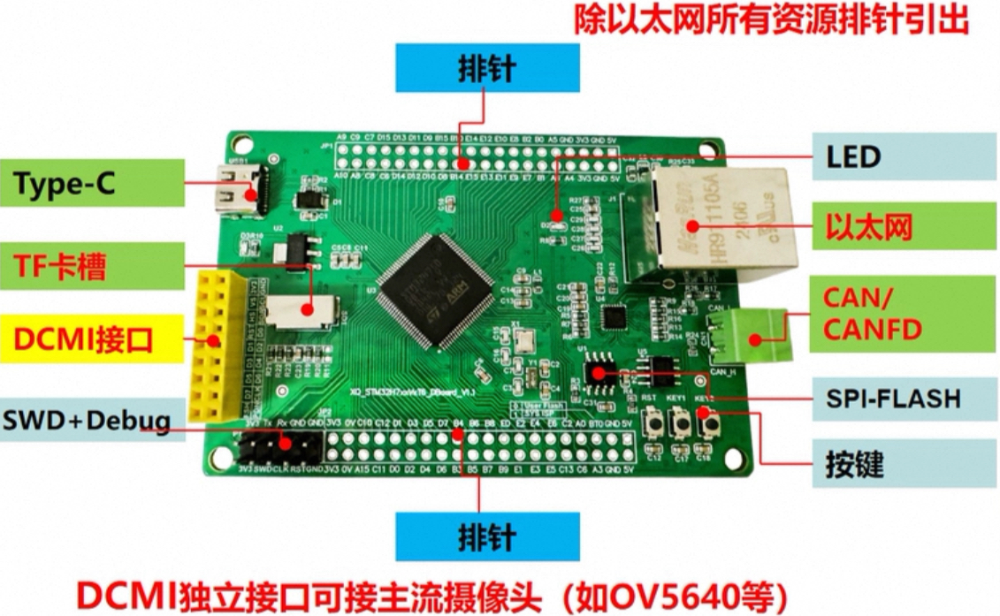

# Micropython Board Definitions for STM32H750VBT6



## Board Specifications

- STM32H750VBT6 480Mhz, ~~128KB ROM~~2MB flash, 1MB RAM
- ARM Cortex M7 Architecture with FPU floating point unit, - complete DSP instruction and memory protection unit MPU
- 2 MB SPI chip (for storage)
- Gold-plated, 4 layer PCB, RoHS process
- User, BOOT0/DFU & reset buttons
- USB C interface, Micro SD card,  3 buttons, DCMI camera - interface, with 1.5V and 2.8V power supply
- Unofficial Support for OpenMV4 development

### Since STM32H750 has 'FREE' and HUGE 2MB FLASH istead of 128K, we can just flash the whole firmware into internal flash. 

### the definition of this H750 board with CAN & Ethernet is based on https://github.com/ikoesters/WEACT_H750VBT6.
## Supported Features

Features and correct Pin assignments are WIP - I combined them from [mcauser](https://github.com/mcauser/MCUDEV_DEVEBOX_H7XX_M) and [Mythologyli](https://github.com/Mythologyli/MicroPython-MCUDev-DevEBox-STM32H743) and have adjusted for the obvious changes, I will test the other features as I need them. Buses should work too.

So far these things are verified to work:

- [x] SD Card
- [x] User LED (RED)

## Build the firmware

Clone the board definitions to your [MicroPython](https://github.com/micropython/micropython) `ports/stm32/boards` folder.

```bash
cd micropython/ports/stm32/boards
git clone https://github.com/WWWWYYYYAAAA/STM32H750_CE.git

cd ..
make BOARD=/STM32H750_CE
```

## Flashing via DFU

This board can be flashed using DFU. To put the board in DFU mode, disconnect
USB, press and hold the B0 button and reconnect USB then release B0.
After installing dfu-util, go the the build folder (`ports/stm32/boards/build-STM32H750_CE`) and type:

```bash
sudo dfu-util -a 0 -D firmware.dfu
```
or

```
micropython/ports/stm32/boards/STMH750_CE$ sudo make BOARD=/STM32H750_CE -j
```

Once the upload is complete, disconnect and reconnect USB.

## Reference

- [mcauser/MCUDEV_DEVEBOX_H7XX_M](https://github.com/mcauser/MCUDEV_DEVEBOX_H7XX_M)
- [Mythologyli/MicroPython-MCUDev-DevEBox-STM32H743](https://github.com/Mythologyli/MicroPython-MCUDev-DevEBox-STM32H743)
- [ikoesters/WEACT_H750VBT6](https://github.com/ikoesters/WEACT_H750VBT6)

## License

Licensed under the [MIT License](http://opensource.org/licenses/MIT).
